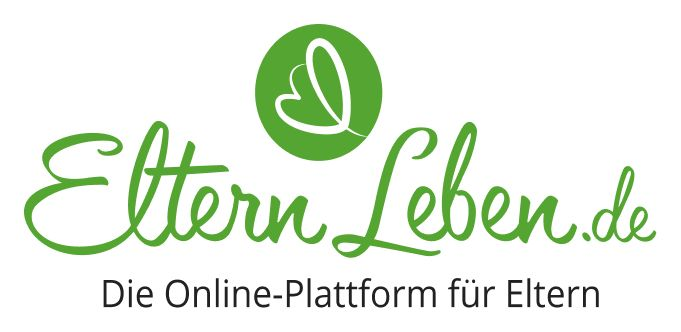
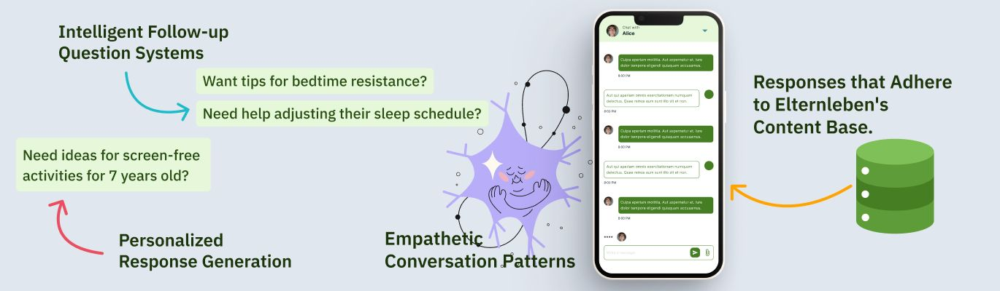
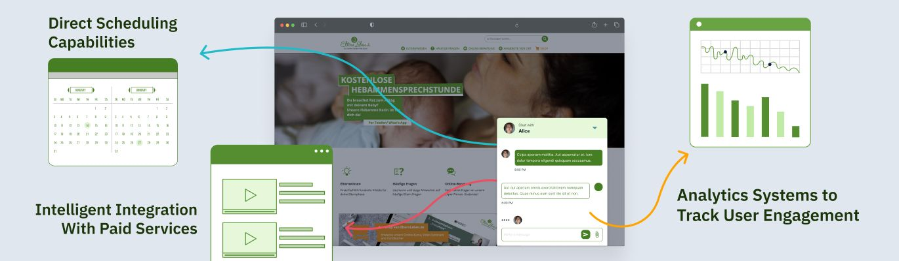
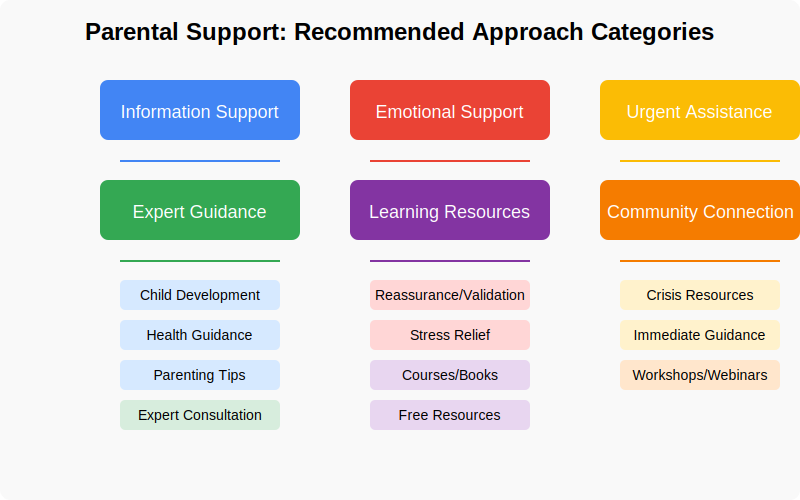

# Transforming Digital Family Support in Germany (with Elternleben.de)

## Challenge Overview

This hackathon focuses on building a conversational AI system for [ElternLeben.de](https://www.elternleben.de/). 

[ElternLeben.de](https://www.elternleben.de/) is a non-profit organization dedicated to provide support, guidance, and expert knowledge they need to create a loving and healthy environment for their children. Through trusted online counseling, educational content, and personalized programs, [ElternLeben.de](https://www.elternleben.de/) ensures no parent navigates the journey alone.

✅ Professional expertise – A network of highly trained specialists offering practical, competent and research-based assistance.

✅ Non-profit mission – driven by transparency and social impact, reinvesting resources to strengthen families and make expert support accessible to all.

✅ Inclusive & welcoming support – Judgment-free help for all parents, regardless of background.

This challenge is supported by Generali.

  

The challenge splits into two primary goals:

1. **High-quality Conversational Intelligence and User Engagement**

   - Building an empathetic, engaging conversation flow with personalized responses
   - Maintaining context and understanding user needs
   - Ensuring high-quality, accurate content recommendations


2. **Multi-Touchpoint Service Integration**

   - Creating seamless connections between the chatbot and service ecosystem
   - Intelligent routing between automated responses and expert consultations
   - Implementing direct scheduling capabilities and analytics tracking

## Implementation Guidelines

To create a chatbot that truly embodies [ElternLeben.de](https://www.elternleben.de/)'s warm and supportive spirit, we recommend these guidelines to help you build something special:

### 1. Content Guidelines 📖
- The chatbot follows the principles of [attachment parenting](https://www.elternleben.de/erziehung-und-foerderung/erziehungsstile/paedagogische-ansaetze-in-der-erziehung/#c5334) and child-focused education.
- It only provides information from the **ElternLeben** repository and always links to reliable sources.
- **Medical questions?** The bot won’t answer them! Instead, it will recommend contacting ElternLeben’s **e-mail counseling service** or a doctor.
- The bot never promotes:
  - 🚫 Aggressive or violent behavior
  - 🚫 Punishment (physical or emotional)
  - 🚫 Reward-based parenting methods
- It stays **on topic** and does not answer questions outside of child development, parenting, and family life.

### 2. Interaction & User Guidance ❤️
- The chatbot is **empathetic and positive**, acknowledging that parenting can be challenging.
- If a user or child might be in danger, the chatbot will **always recommend reaching out to ElternLeben’s e-mail counseling** directly.
- It ensures that users seeking **personal counseling** are guided to real experts. The bot never acts as a replacement for professional help.
- At the same time, not all users require personal counseling. The chatbot finds the right balance between **self-help content and expert recommendations**, tailoring responses to the user’s needs.

### 3. Conversational Experience 💬
- Instead of overwhelming users with long answers, the chatbot keeps things **interactive** and easy to follow. It:
  1. First, understands the user's situation 🤔
  2. Asks follow-up questions in a friendly, natural way 🗣️
  3. Provides **short, to-the-point answers** ✅
  4. Always links to **helpful content** for more details 🔗
- The chatbot **checks in with users** to see if they found the answer helpful and offers further guidance if needed.

By following these principles, you will create a **warm, supportive, and informative** experience for parents. 💛


## Dataset Contents

### Dataset Status
This dataset represents a **static snapshot** of ElternLeben.de's content base as of the start of the AI for Impact programme. While ElternLeben's live website regularly publishes new pages and improves existing content, this repository version will remain unchanged throughout the programme duration.

### For Participants
- This dataset is provided exclusively for use in the AI for Impact programme
- The content reflects ElternLeben.de's structure at the time of capture
- No updates to this dataset will be provided during the programme

### Building Update-Ready Solutions
Participants are encouraged to:
- Design solutions that could accommodate future content updates
- Consider how a production system might connect to TYPO3 content management system
- Develop mock update mechanisms if desired for demonstration purposes

### Dataset Content

This package contains the following resources:

- **[data_exploration.ipynb](data_exploration.ipynb)**: Jupyter notebook with sample analysis to help understand the dataset
- **[metadata.csv](data/metadata.csv)**: Metadata for all content pages from Elternleben.de
- **[processed_conversations.csv](data/processed_conversations.csv)**: Anonymized conversation logs from a previous chatbot prototype
- **[content/](data/content/)**: Directory containing markdown files with content from the website
- **[mock_api/](data/mock_api/)**: Directory containing the Mock API for service integrations

## Data Schema

### Content Metadata (`metadata.csv`)

| Column | Type | Description |
|--------|------|-------------|
| url | String | Full URL of the content page |
| filepath | String | Internal file path, reflects the content hierarchy |
| filename | String | Name of the content file |
| title | String | Article title |
| description | String | Brief description/summary of the content |
| author | String | Content author (may be empty) |
| category | String | Primary content category |
| crawled_at | String | Timestamp when the content was crawled |

### Conversation Data (`processed_conversations.csv`)

| Column | Type | Description |
|--------|------|-------------|
| conversation_id | Integer | Unique identifier for each conversation |
| conversation_start | String | Timestamp when the conversation started |
| request_timestamp | String | Timestamp of the user's message |
| response_timestamp | String | Timestamp of the chatbot's response |
| user_message | String | The user's message text |
| chatbot_response | String | The response from the chatbot |
| response_links | String | URLs to content recommended by the chatbot |
| needs_escalation | Float | Flag (0/1) indicating if human intervention was needed (evaluated post-hoc by a human) |
| recommended_approach | Float | Suggested approach code (evaluated post-hoc by a human) |

**Notes on Conversation Data**:
- Parent interactions tend to fall into these categories:
    1. **Information-Seeking Queries**: Age-specific development questions, sleep problems and routines, feeding and nutrition concerns, behavior management questions
    2. **Problem-Solving Conversations**: Specific challenges with children, crisis management (tantrums, sleep regression), health concerns, developmental worries
    3. **Service-Related Interactions**: Webinar registration inquiries, consultation scheduling, expert advice requests, follow-up conversations after content consumption
    4. **Support-Seeking Conversations**: Emotional validation requests, shared experiences, uncertainty/anxiety about parenting decisions, confidence-building interactions
    5. **Transition Points**: Life stage changes (newborn to infant, starting kindergarten), developmental milestone concerns, shifting from information gathering to service booking
- A single conversation (identified by `conversation_id`) may contain multiple message exchanges
- `response_links_1` - `response_links_5` contain URLs from the response
- `needs_escalation` values:
  - 0: No escalation needed
  - 1: Escalation to human operator was needed
- `recommended_approach` values:
  - Information Support
  - Expert Guidance
  - Emotional Support
  - Learning Resources
  - Community Connection
  - Urgent Assistance




Understanding these conversation categories can help design more effective chatbot flows that address different parent needs and contexts.

### Content Files (Markdown)

The content directory contains markdown files organized according to the website structure. Each markdown file follows this format:

```markdown
---
author: ''
category: elternleben
crawled_at: '2025-03-04T10:11:34.936030'
description: Brief description of the article
filename: article-name.md
filepath: category/subcategory/article-name.md
title: Article Title
url: https://www.elternleben.de/category/subcategory/article-name/
---

# Main Heading

Introduction text...

## Subheading 1

Content for section 1...

## Subheading 2

Content for section 2...
```

### Content Structure

The content follows this hierarchical structure:

```
elternleben
├── baby
│   ├── baby-beschaeftigen
│   ├── babyausstattung
│   ├── babynahrung
│   └── ...
├── elternwissen
│   ├── kita-kind
│   ├── kleinkind
│   │   └── erziehung-und-bildung
│   └── ...
└── ...
```

The directory structure reflects the content categorization on the website and shows topic relationships. The full directory tree can be found in [**tree.md**](data/tree.md).

## Service Integration Guidelines

Your chatbot solutions should integrate with two service types:

### Webinar Services

Represents online seminars that users can register for:
- Webinar topic
- Date and time
- Duration
- Description
- Registration requirements (name, email)

### Consultation Bookings

Represents one-on-one consultations users can schedule:
- Service type (e.g., sleep consultation, feeding advice)
- Available time slots
- Duration
- Price
- Booking requirements (name, email, phone)

For the hackathon, mock API interfaces for these services are provided. No actual connection to Zoom or SimplyBook is needed.

## Setting Up Your Environment

Before exploring the data or running the mock API, you'll need to set up your Python environment:

1. **Clone this repository**:
   ```bash
   git clone <repository-url>
   cd ai4impact-elternleben
   ```

2. **Create a virtual environment**:
   ```bash
   python -m venv .venv
   ```

3. **Activate the virtual environment**:
   - On Windows:
     ```powershell
     .venv\Scripts\activate
     ```
   - On macOS/Linux:
     ```bash
     source .venv/bin/activate
     ```

4. **Install dependencies**:
   ```bash
   pip install -r requirements.txt
   ```

5. **Run Jupyter Notebook**:
   ```bash
   jupyter notebook
   ```
   Then open `data_exploration.ipynb` in your browser to start exploring the dataset.

## Running the Mock API

The mock API provides endpoints for webinar management and appointment booking. It uses a SQLite database with German-language sample data.

### Setting Up and Running

1. **Navigate to the API folder**:
   ```bash
   cd mock_api
   ```

2. **Create the database with sample data**:
   ```bash
   python create_database.py
   ```
   This creates a SQLite database (`mock_api.db`) with German examples of webinars, experts, and appointments.

3. **Run the FastAPI application**:
   ```bash
   uvicorn mock_api:app --reload
   ```
   The API will be available at http://127.0.0.1:8000

4. **API documentation**:
   - Interactive Swagger UI: http://127.0.0.1:8000/docs
   - ReDoc interface: http://127.0.0.1:8000/redoc

### Available Endpoints

#### Webinar API (Zoom-like)

- `GET /webinars` - List webinars
- `GET /experts/{expert_id}/webinars` - List webinars per expert
- `GET /webinars/{webinar_id}/registrants` - List webinar registrants
- `POST /webinars/{webinar_id}/registrants` - Create a new webinar registration
- `PATCH /webinars/{webinar_id}/registrants/{registrant_id}` - Update registration

#### Consultation API (SimplyBook-like)
- `GET /experts` - List all experts
- `GET /experts/available` - List available experts
- `GET /experts/{expert_id}/available-slots` - Get expert's available time slots
- `POST /bookings/new` - Create a new appointment
- `PATCH /bookings/{appointment_id}` - Update an appointment
- `DELETE /bookings/{appointment_id}` - Cancel an appointment

### Database Structure

The database contains four tables:
- `webinars`: Information about upcoming webinars (ISO 8601 datetime format)
- `webinar_registrations`: Tracks registrations for webinars
- `experts`: Information about available experts
- `appointments`: Tracks appointments with client info (YYYY-MM-DD HH:MM format)

## Getting Started

1. **Explore the data**: Begin with the data_exploration.ipynb notebook to understand the dataset
2. **Understand the content structure**: Browse the markdown files to see the type of content being provided
3. **Analyze conversation patterns**: Review the conversation data to identify common user queries and expectations
4. **Design your approach**: Plan your chatbot architecture considering both conversational intelligence and service integration
5. **Implement and test**: Build your solution and test against realistic user scenarios

## Evaluation Criteria

Your solution will be evaluated based on:

1. **(Goal 1) Conversational Intelligence**
   - Natural dialog flow
   - Context maintenance
   - Appropriate response personalization
   - Accurate content recommendations

2. **(Goal 2) Service Integration**
   - Seamless transitions from information to services
   - Effective booking/registration flows
   - Proper handling of user information
   - Analytics capabilities

3. **Technical Implementation**
   - Code quality and structure
   - Performance and scalability
   - Innovative approaches to challenges
   - Documentation quality

## Resources

- Basic Python libraries for NLP and data processing
- Mock API interfaces for service integration
- Markdown parsing utilities
- Data exploration notebook

Good luck and happy coding!